# 🧭 Guía Paso a Paso: Modelo de Información y Diagrama de Contexto

Esta guía complementa el `README.md` del taller. Cubre los dos entregables de la Parte 1 y la Parte 2: el **modelo entidad-relación (ERD)** y el **diagrama de contexto de negocio**, ambos construidos sobre el caso base de la Clínica Salud Viva.

---

## Parte A — Modelo Entidad-Relación (ERD)

### A.1 Leyenda de notación ERD

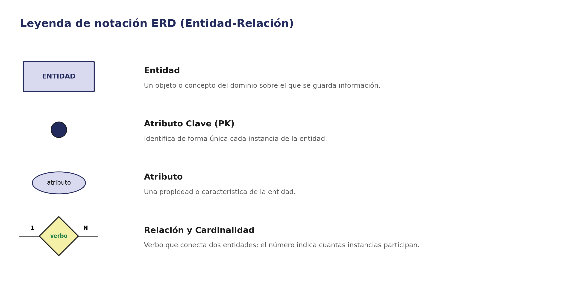

### A.2 Metodología en 4 pasos

1. **Identificar entidades** — liste los sustantivos clave del dominio sobre los que necesita guardar información.
2. **Definir atributos** — para cada entidad, anote sus propiedades y marque cuál es la clave primaria (PK).
3. **Trazar relaciones** — conecte las entidades que se relacionan entre sí y nombre cada relación con un verbo.
4. **Asignar cardinalidad** — indique cuántas instancias participan a cada lado de la relación (1:1, 1:N, N:N).

### A.3 Ejemplo guiado: Paciente, Cita, Médico, Especialidad y Factura

#### Paso 1 — Identificar entidades

Del caso base se extraen cinco entidades: **Paciente**, **Cita**, **Médico**, **Especialidad** y **Factura**. Cada una representa un concepto sobre el que la clínica necesita guardar datos.

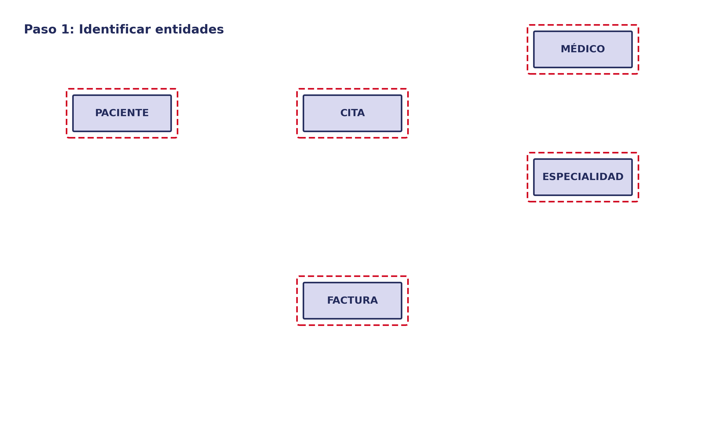

#### Paso 2 — Definir atributos

Se agrega a cada entidad su atributo clave (círculo oscuro) y sus atributos descriptivos. Por ejemplo, `CodPaciente` identifica de forma única a cada paciente; `Nombre` es solo descriptivo.

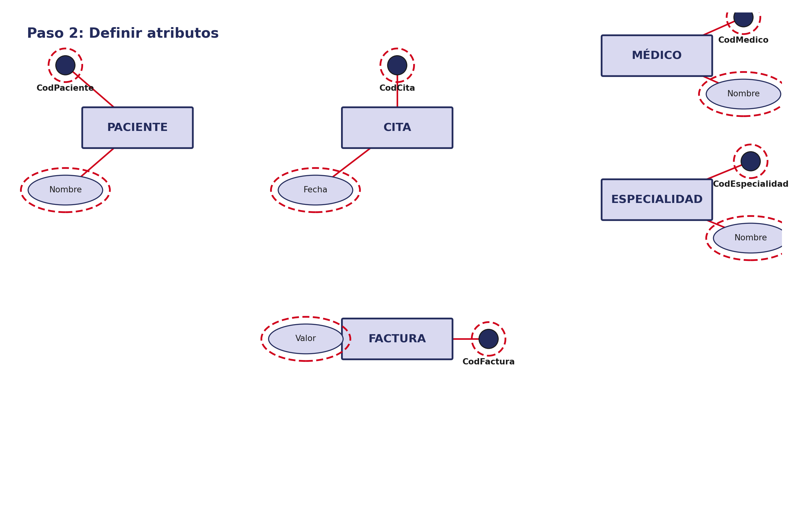

#### Paso 3 — Trazar relaciones

Se conectan las entidades relacionadas y se nombra cada relación con un verbo: el paciente **agenda** una cita, la cita es **con** un médico, es **de** una especialidad y **genera** una factura. En este paso aún no se define cuántas instancias participan.

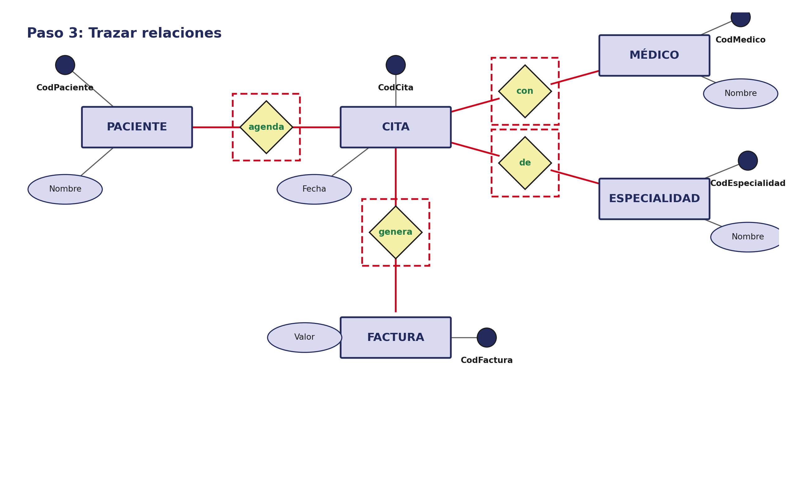

#### Paso 4 — Asignar cardinalidad

Se etiqueta cada extremo de cada relación. Un paciente puede agendar muchas citas (1:N), pero cada cita es con un solo médico (N:1) y de una sola especialidad (N:1), y genera exactamente una factura (1:1).

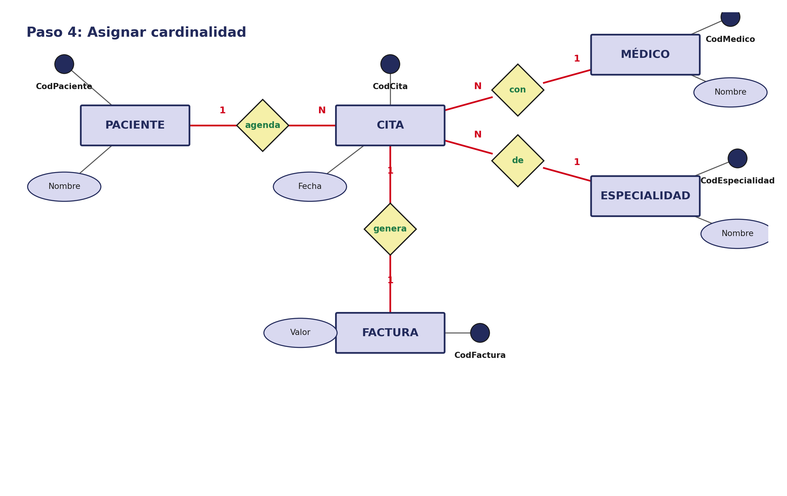

### A.4 Errores comunes en el ERD

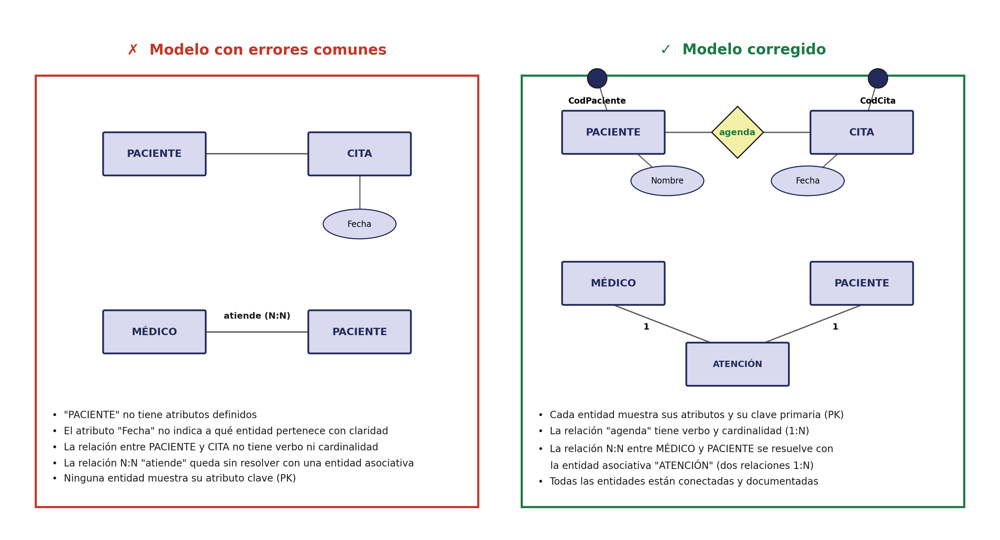

---

## Parte B — Diagrama de Contexto de Negocio

### B.1 Leyenda de notación

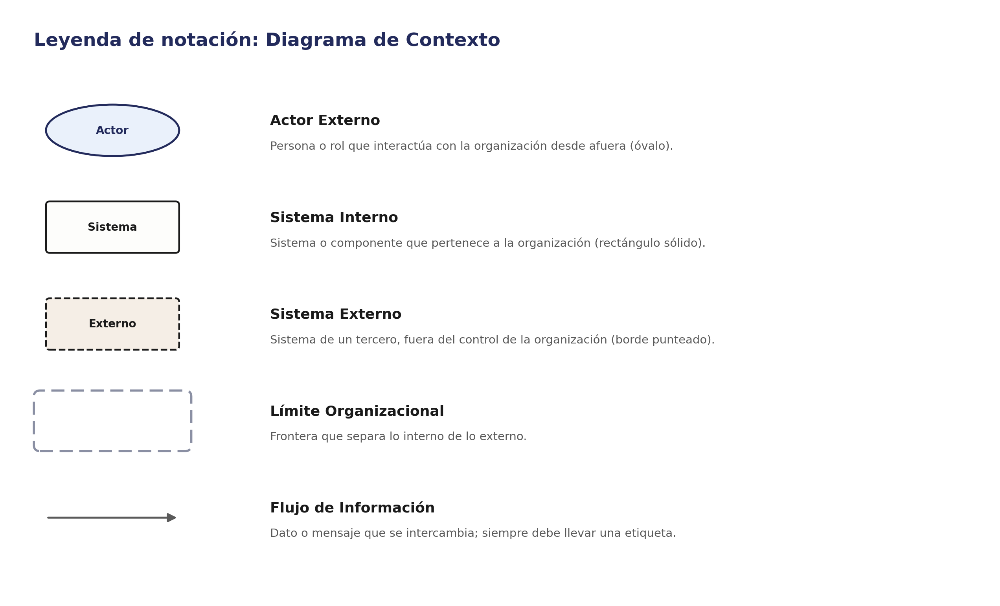

### B.2 Metodología en 4 pasos

1. **Identificar actores externos** — ¿quién interactúa con la organización desde afuera? Incluya también los sistemas de terceros con los que se intercambia información.
2. **Identificar sistemas internos** — trace el límite organizacional y ubique dentro los sistemas propios que participan en el proceso.
3. **Trazar flujos de información** — conecte actores y sistemas según quién envía información a quién.
4. **Etiquetar flujos y validar** — indique qué información viaja por cada flujo y confirme que ningún actor o sistema quede sin conexión.

### B.3 Ejemplo guiado: contexto de la Clínica Salud Viva

#### Paso 1 — Identificar actores externos

Se identifican el **Paciente**, el **Médico** y el **Asistente Administrativo** como actores que interactúan con la clínica, y la **Aseguradora** como sistema externo (no pertenece a la organización).

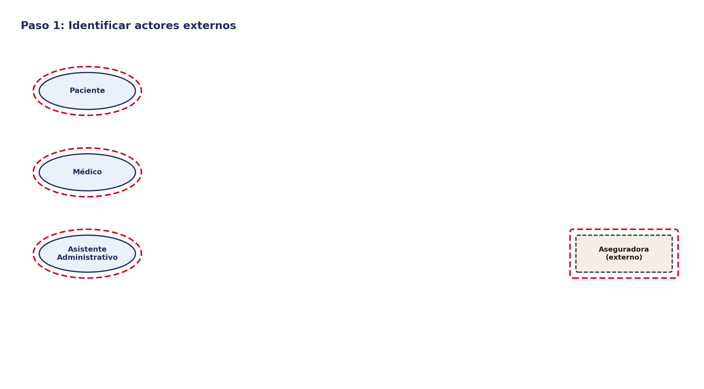

#### Paso 2 — Identificar sistemas internos

Se traza el límite organizacional de la Clínica Salud Viva y se ubican dentro los tres sistemas propios: **Sistema de Agendamiento**, **Notificador (SMS/Email)** y **ERP Clínico**.

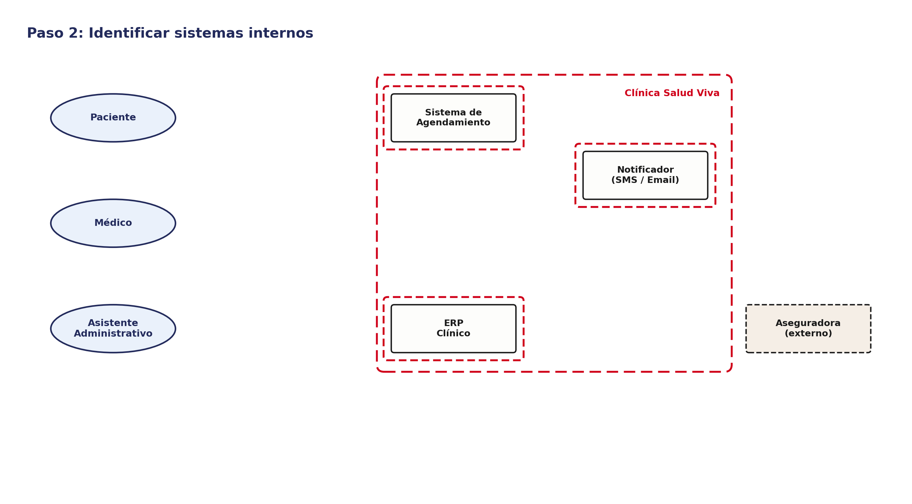

#### Paso 3 — Trazar flujos de información

Se conectan los actores y sistemas externos con los sistemas internos correspondientes, según quién necesita comunicarse con quién.

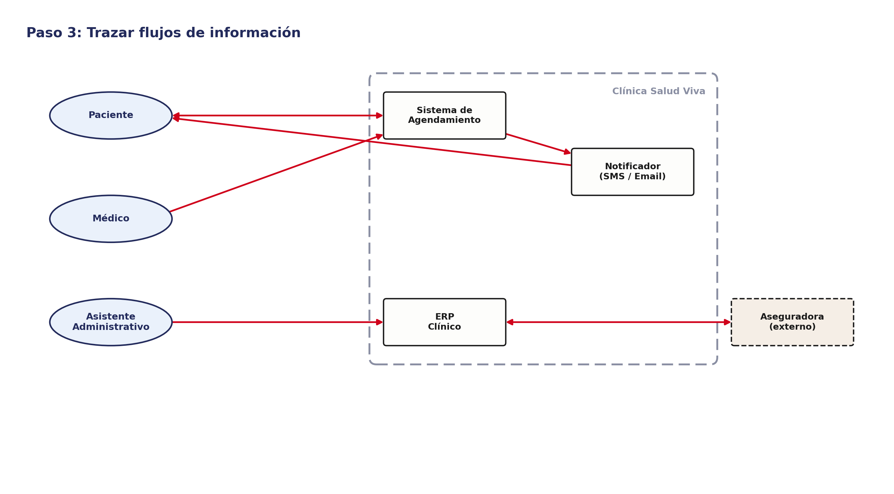

#### Paso 4 — Etiquetar flujos y validar

Se etiqueta cada flujo con la información que transporta (p. ej. "Solicitud / Confirmación de cita", "Validación de cobertura"). Un diagrama de contexto sin etiquetas no comunica nada: la etiqueta es tan importante como la flecha misma.

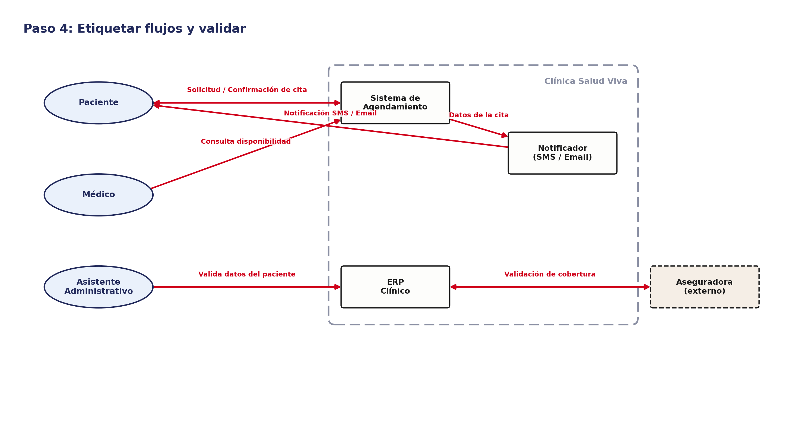

### B.4 Errores comunes en el diagrama de contexto

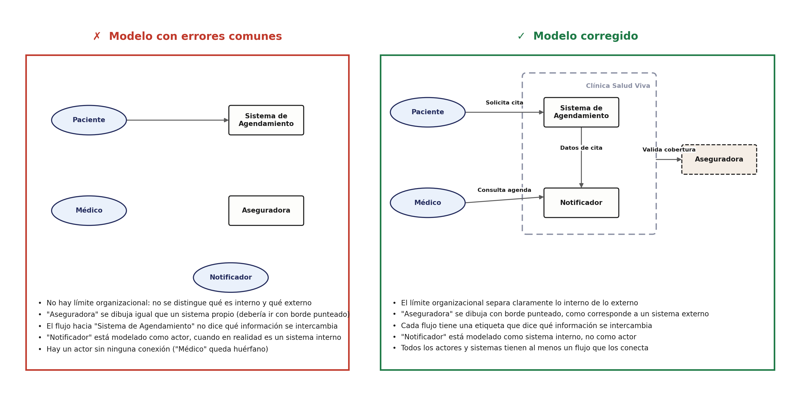

---

## Checklist de autoevaluación antes de entregar

**Modelo ER:**

- [ ] Cada entidad tiene al menos un atributo y una clave primaria (PK) marcada.
- [ ] Toda relación tiene un verbo que la nombra.
- [ ] Toda relación tiene su cardinalidad en ambos extremos (1:1, 1:N o N:N).
- [ ] Las relaciones N:N están resueltas con una entidad asociativa (no se dejan como N:N directas).
- [ ] No hay entidades desconectadas del resto del modelo.

**Diagrama de contexto:**

- [ ] El límite organizacional está dibujado y separa claramente lo interno de lo externo.
- [ ] Los sistemas de terceros se distinguen visualmente de los sistemas propios (borde punteado).
- [ ] Cada flujo tiene una etiqueta que explica qué información se intercambia.
- [ ] Ningún actor ni sistema queda sin al menos una conexión.
- [ ] Los elementos están clasificados correctamente (un sistema no se modela como actor, y viceversa).

---

## Vista ArchiMate equivalente

Este taller alimenta dos capas de ArchiMate a la vez (ver la [Guía de Notación ArchiMate](https://github.com/CesarAVegaF312/AREM-ArchiMate/blob/main/guia_notacion_archimate.md)): las entidades del ERD se convierten en **Data Objects** de la capa de Aplicación, y los sistemas del diagrama de contexto (ERP, Notificador, Sistema de Agendamiento) se convierten en **Application Components**.

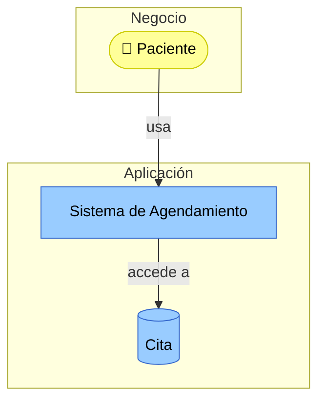

El ERD (`modelo-final-er.drawio`) sigue siendo donde vive el detalle de atributos y cardinalidades; aquí solo se resume la entidad como un Data Object que un Application Component usa — la misma relación **Access** que aparece en el Taller 3 al describir cómo un contenedor del C2 usa una base de datos.

---

_Esta guía hace parte del Taller 2 de Modelo de Información y Diagrama de Contexto — curso Arquitectura Empresarial, Universidad de La Sabana._
